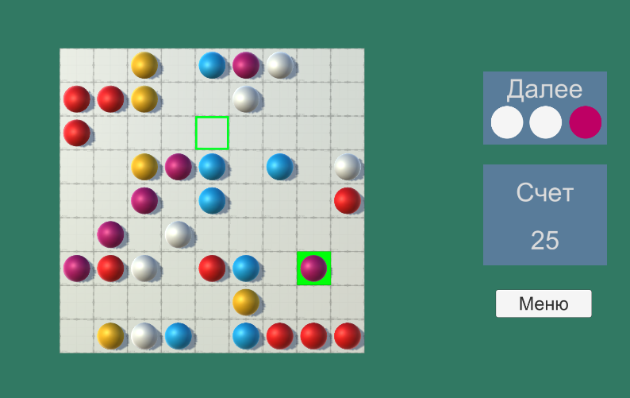

#### Краткое описание

Реплика игры в жанре 3-в-ряд, которая была доступна на телевизорах Rolsen около 15 лет назад. Полностью играбельна - от главного меню до финального результата с таблицей рекордов.

#### О коде игры

* Все что нужно кэшировать - кэшируется
* Интерфейс взаимодействует с остальной игрой через события
* Сериализация, сохранение и загрузка <<<<<>>>>>
* Реализован алгоритм поиска пути А*
* Реализован паттерн Command и возможность отмены хода
* Мультиплатформенное управление
* Два набора сцен ююю
* Работоспособность игры проверялась и через эмулятор Android, и через Unity Remote 

##### Минусы:
* ааа

##### Скриншот игрового процесса:

